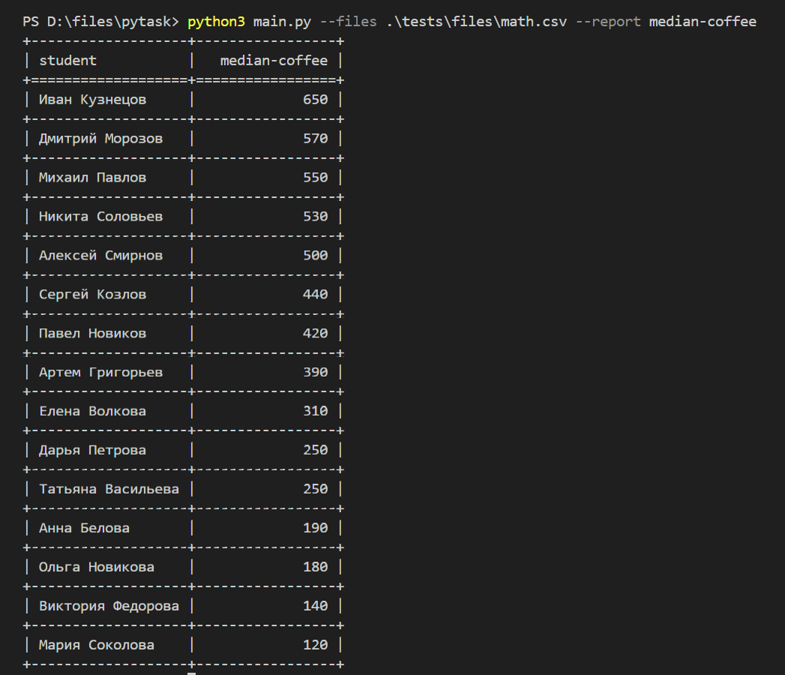
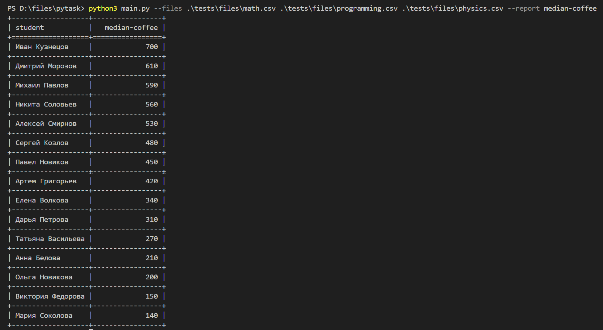
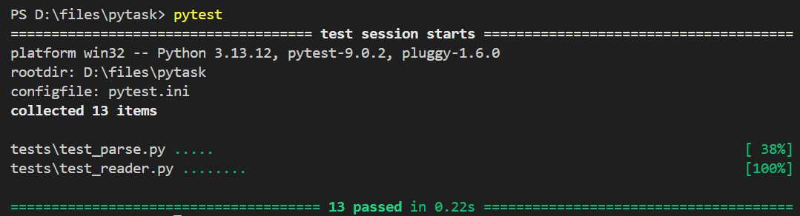

# Report Generator

## Проверка решения







## Архитектура
У каждого репорта есть свой класс. Для median-coffee это MedianCoffeeReport,
```python
class MedianCoffeeReport(Report):
    def print_result_table(self, csv_data: list[dict[str, Any]]) -> None:
        headers = [ "student", "median-coffee" ]
        result_table = resulting_table(csv_data, "student", "coffee_spent", median)

        print(tabulate(result_table, headers=headers, tablefmt="grid"))
```
который имплементирует print_result_table класса Report
```python
class Report(ABC):
    @abstractmethod
    def print_result_table(self, csv_data: list[dict[str, Any]]) -> None:
        pass
```
Таким образом, можно создавать новые репорты и при этом не менять существующий код. Надо просто создать новый класс-репорт и изменить в нем хедеры, столбцы, функцию (median, mean...), или прочее

```python
# mean вместо median
headers = [ "student", "mean-coffee" ]
result_table = resulting_table(csv_data, "student", "coffee_spent", statistics.mean)
print(tabulate(result_table, headers=headers, tablefmt="grid"))

# sleep_hours вместо coffee_spent
headers = [ "student", "median-hours" ]
result_table = resulting_table(csv_data, "student", "sleep_hours", statistics.median)
print(tabulate(result_table, headers=headers, tablefmt="psql"))
```

